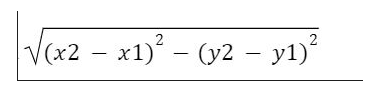
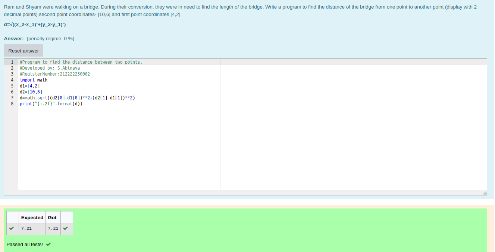

# DISTANCE-BETWEEN-TWO-POINTS

## AIM:
To write a python program to find the distance between 2 points
## ALGORITHM:
### Step 1: 
Using import math function,do the calculations.
### Step 2: 
Take the two coordinates as |1 and |2
### Step 3: 
Substitute the values in the distance formula  

### Step 4: 
Using the print function,display the distance between the two points.
### Step 5: 
end the program
### PROGRAM:
```
#Developed by: S.Abinaya
#RegisterNumber:212222230002
import math
d1=[4,2]
d2=[10,6]
d=math.sqrt((d2[0]-d1[0])**2+(d2[1]-d1[1])**2)
print("{:.2f}".format(d)) 
```


### OUTPUT:


### RESULT:
Thus,a python program to find the distance between 2 points is executed successfully.
